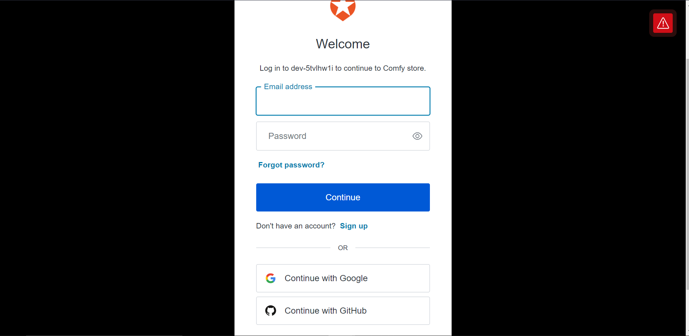
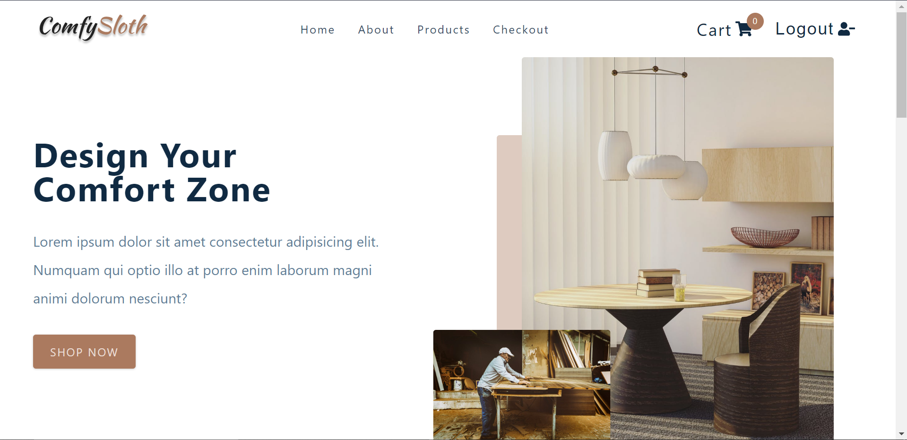

# Comfy Sloth

E-commerce website for `furniture`

## Features and Interfaces

1. Landing Page and Login Form

   - Seamless Login page with `Login with Google and Github` button for user Login using Auth0) Authentication
   - 

   - Landing Pafe for comfy sloth 
   - 

   